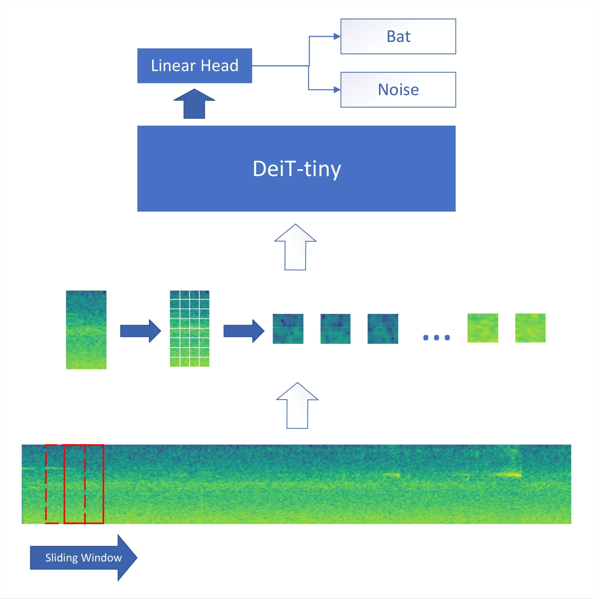
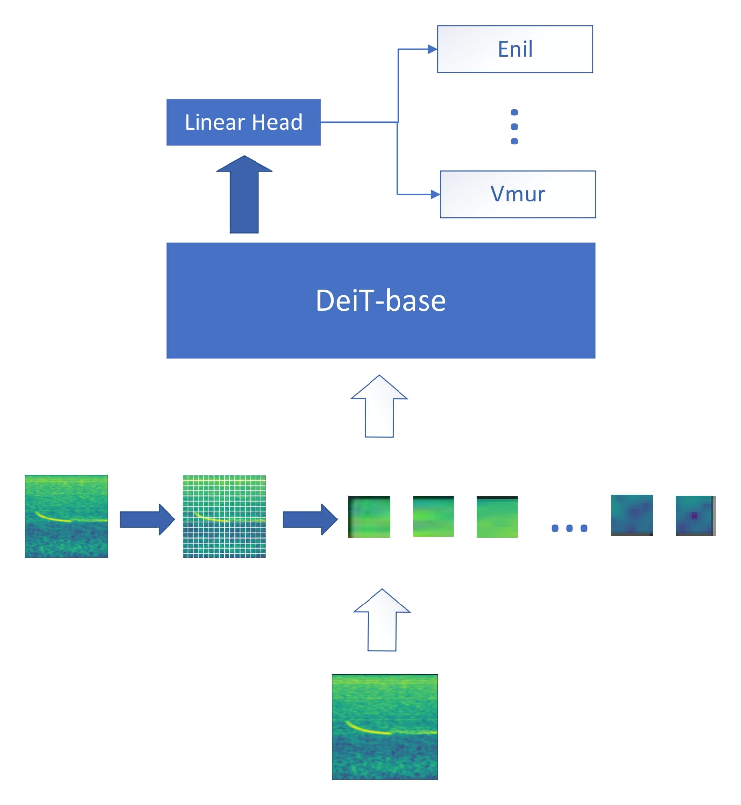

# Transformer4bats
## Introduction
<p align="center">
    
    
</p>
This repository contains a demonstration of the trained models proposed in "Bat Echolocation Call Detection and Species Recognition by Transformers with Self-Attention".

## Setup
1. Clone this repository and install the required packages. Make sure to use Python 3.7 or newer.
    ```
    cd transformer4bats/ 
    pip install -r requirements.txt
    ```
2. Download the [model files](https://hessenbox.uni-marburg.de/getlink/fiYVy5JVHGWrDjkgHD1WzbW5/transformer4bats) and place them into the ```models``` directory.
3. Use ```simple_infer.ipynb``` to run the bat call detection. By default, a file provided by the [Tierstimmenarchiv](https://www.tierstimmenarchiv.org) is used. 


## Citation
```  
@inproceedings{bellafkir2022bat,
  author={Hicham Bellafkir and Markus Vogelbacher and Jannis Gottwald and Markus M\"uhling and Nikolaus Korfhage and Patrick Lampe and Nicolas Frie\ss{} and Thomas Nauss and Bernd Freisleben},
  title={{Bat Echolocation Call Detection and Species Recognition by Transformers with Self-Attention}},
  year=2022,
  booktitle={The International Conference on Intelligent Systems and Patterns Recognition, Hammamet, Tunisia},
  pages={},
  doi={}
}
